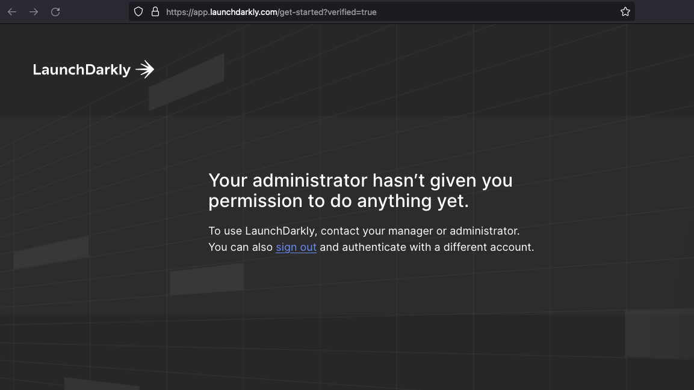

# Kansas City React Meetup + LaunchDarkly

<p align="left">
    &nbsp;
    &nbsp;
    
</p>

## Overview

This repo contains the example app we'll use during the [KC React Meetup on 6/22/2022](https://www.meetup.com/kansas-city-react-meetup/events/zrtdtsydcjbdc/).

In this meeting we're going to work through a guided coding exercise. We'll start from a simple app, progressively add new features to it, then release those features using feature flags.

## About the app

We're going to transform a "stock" React app into a new version of the [Dinosaur Game](https://en.wikipedia.org/wiki/Dinosaur_Game) found in Chrome. We'll start with a default React app and work through a series of steps to build up the game.

This repo contains the output of `create-react-app`. The only modifications include:
 * The [LaunchDarkly React Client SDK](https://github.com/launchdarkly/react-client-sdk) has been added to `package.json`
 * A `.env.local` file has been added at the project root
 * `images` and `sounds` have been added to the `public` folder
 * A `workshop` folder containing the final version of the app files for each step of the exercise has been added at the project root

## Exercise Setup

### LaunchDarkly (Facilitator)

#### **Flags**

* The facilitator will need a Project to house the flags we'll use during the Workshop
* Create the following feature flags in the Workshop project prior to the session:

| Name      | Key | Type | Variations | Default | Tag |
| --------- | ---- |---- | ---------- | ------- | ----|
| Dark Mode | dark-mode | bool | true, false| false | master |
| Game Theme| game-theme | string | Dino, Space | Dino | master |
| Runner Speed | runner-speed | number | 2, 6, 8, 12, 24 | 8 | master |
| Gravity   | gravity | number | 1, 0.6, 0.3, 0.1 | 0.6 | master |
| Show Details | show-details | bool | true, false | false | master |

> **_Note_:** It's recommended the facilitator apply a `master` tag to these flags. This will help you secure and maintain them as a reusable 'master' set that cannot be altered by attendees. We'll set up these permissions in the next section. 

* Next, make a [Clone](https://docs.launchdarkly.com/home/getting-started/feature-flags/?q=clone#cloning-flags) of each of these flags. This will give your participants a set of flags they can then Clone and modify (add/remove Variations, etc.) without altering your originals.

#### **Teams**

With the flags set up, we need to invite our session attendees to use LaunchDarkly.
* Go to Account Settings &#8594; Members &#8594; Invite members, and enter the email addresses of your attendees
>**_Important:_** Be sure to set the `Initial role` to **No Access**.
* Your attendees should see a page like this after they join via your email Invite: 

Next, we need to assign our session attendees to a Team. 

The recommended setup is to create a new Team for the Workshop, then invite attendees to be members of that new Team:
* Go to Account Settings &#8594; Teams &#8594; Create team
* After you create the team, you can make your attendees Members of the Team **whether they've accepted the invitation or not**
    * Go to your new Team &#8594; Add members to add them

#### **Permissions**

Now we need to set up the Permissions for our new Team.

We'll give our attendees permission to create+modify flags in the Workshop project, but only in their environments. Attendees will **not** be allowed to change flags in production, especially not our master flag set.

Permissions are assigned to Teams via Custom Roles. To create a new Custom Role:
* Go to your new Team &#8594; Permissions &#8594; Create a new custom role
* Complete the Create role form like this:
    * **Name:** give it a name
    * **Key:** give it a key
    * **"...members can view all content...":** Checked
    * **Role policy:** add two "Except for" statements like this:
        * Except for **Project: (your project key)** - **<span style="color: red">DENY</span>** all actions
        * Except for **All feature flags** tagged **master** in Environment: production in Project (your project key) - **<span style="color: green">ALLOW</span>** all actions
        * Example Policy JSON (Advanced editor):
        ```json
        [
            {
                "notResources": ["proj/(your proj)"],
                "actions": ["*"],
                "effect": "deny"
            },
            {
                "notResources": ["proj/(your proj):env/production:flag/*;master"],
                "actions": ["*"],
                "effect": "allow"
            }
        ]
        ```

### LaunchDarkly (Participants)

As an attendee, you'll need access to a LaunchDarkly Account to fully participate in this session. 

* You will receive an email invitation to LaunchDarkly from the workshop faciliator
* Participants should verify they can log into the Workshop Project and have their own **Environment**

### Gitpod Setup

We'll be using [Gitpod.io](gitpod.io) for this session. Gitpod provides a development workspace participants can use to work along during the coding walkthrough.

To set up Gitpod:

1. Fork my repo: [https://github.com/cleon/kc-react-launchdarkly](https://github.com/cleon/kc-react-launchdarkly)
2. Log into/register for [Gitpod.io](https://gitpod.io)
3. Create a new Workspace
4. Select your forked repo from "Open in Gitpod"
5. When you see your Workspace created, you're ready to get started

## Session Walkthrough

The session work will be split into five steps. During each step, we'll make noticable changes to the original/previous codebase and then run the app to see the differences. 

Attendees can follow along or simply replace the contents of each file involved in each step with the contents of the file located in that step's folder under `workshop`. For example, to see the final result of step one, replace the app files with the files located in `workshop/step1`. To see the final working app, replace the contents of `src` with the contents of `workshop/final`.

Here's a basic outline of the tasks and concepts for each step:

**Step 1 - Get wired up**
- Run the app as-is (no feature flags)
- Clone the `clone-me-dark-mode` flag in LD, remeber the name (flag key)
- Grab **clientSideID** from individual LaunchDarkly **Environment** 
- Update `index.js` to initialize LD
- Update `.env.local` with attendee's **clientSideID**
- Update `app.js` with the name of your dark-mode-flag
- Run app to verify connectivity
- Toggle your cloned dark-mode flag in LD, see the text change

**Step 2 - Run the game, implement dark mode**
- Make the game run (no flags)
- LD: Toggle off dark-mode
- Update code for dark mode FF

**Step 3**
- Clone `clone-me-game-theme` flag in LD
- Update code for theming
- LD: toggle game theme flag, see the effect

**Step 4**
-`clone-me-runner-speed` 
- Clone `clone-me-gravity` flag in LD
- Update code for Targeting
- View the current User, change the User
- Create Targeting rules, see the effect on dark mode, theme or gravity flags
- Configure a Percentage rollout

**Final**
- Clone `clone-me-show-details`
- Update code to show game settings detail